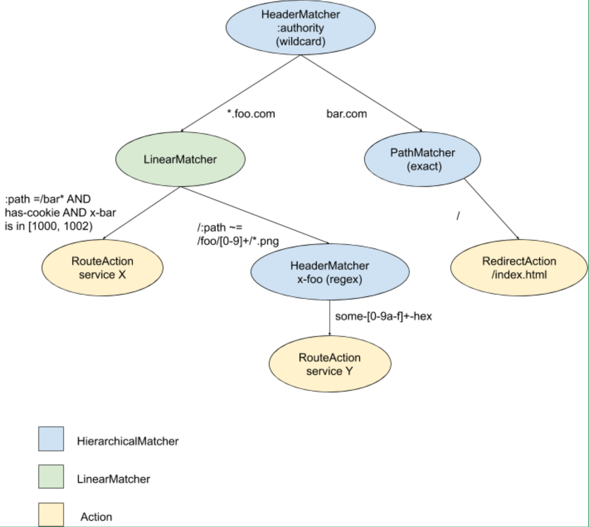

UDPA设计之数据模型

> 翻译自：[UDPA-DM: L7 routing strawman](https://docs.google.com/document/d/1orxTIL9FXtgmyl5TtPRBqGjgp1ekL7oOKDd95wxeCRY)

## 概况

Envoy v2 xDS API 当前正在转换为 通用数据平面API（UDPA）。其主要方面是将传输协议与数据模型的关注点分离。在较早的文档中，我们探讨了UDPA传输协议的建议。以下文档以L7路由为例，重点介绍UDPA的数据模型方面。

首先，我们认识到 UDPA-DM 不需要像任何给定的DPLB客户端的全部能力一样具有表现力，而是应该可以从 UDPA-DM 转换为各种 DPLB 本地配置格式。我们将 UDPA-DM 设想为一种通用语言，它捕获了 DPLB 可能提供的大量有用功能，从而有可能在支持 UDPA 的 DPLB 周围构建通用的控制平面和生态系统。

UDPA-DM 将成为事实标准。我们期望它最初将涵盖 DPLB 共享的一些显而易见的通用功能，同时将其他行为留给代理特定的API字段。随着时间的推移，我们期望 UDPA-DM 将通过稳定的API版本控制策略来发展，以适应我们协商通用表示形式的功能。

对于本文档，进一步的关键设计动机包括：

- 描述一个L7路由层，该层捕获主要 L7 DPLB 之间的常见行为，包括 Envoy，HAproxy，Nginx，Google Cloud Platform URL映射和Linkerd。
- 为不适合通用抽象的行为的代理/ LB特定扩展提供灵活性。 即 逃生舱口
- 提供L7路由表的可伸缩性和有效的对数评估。 例如，Envoy v2 xDS是严格线性评估的路由表，具有明显的扩展限制。 对于可以支持 UDPA-TP 这方面的DPLB，应该可以按需获取路由表段。
- 在v2 Envoy xDS API中支持线性匹配路由表的旧用户。
- 删除无需多个xDS样式的API，例如 RDS，VHDS和SRDS。
- 资源的可组合性； 应该有可能支持UDPA联邦用例，带有诸如虚拟主机这样被独立管理等资源

## 术语

有关UDPA通用术语的列表，请参见UDPA-TP术语。

特定于 UDPA-DM 和 L7 路由的其他术语：

- 服务/Service：描述后端服务的不透明字符串（或在Envoy的术语中，为集群/Cluster）。 当前文档未提供有关服务表示的任何进一步详细说明，这留待以后的工作。
- 路由表/Route table：一组匹配条件，用于HTTP请求和相关操作。 操作可以包括重定向或转发到特定服务。
- L7路由/L7 routing：根据路由表评估给定的HTTP请求。

## 路由数据模型

### 线性和层次匹配

路由时，有两种匹配请求的关键样式：

- 线性（Linear）：其中路由表类似于`[([Match], Action)]` 类型。 在此模型中，路由表是 匹配 criteria-action 条件的有序列表。 每个匹配的 criteria 是匹配 criteria 的逻辑"与"，例如
	* If :authority == foo.com AND path == / AND x-foo == bar THEN route to X
	* If :authority == bar.com AND x-baz == wh00t THEN route to Y
- 分层(Hierarchical)：其中路由表类似于树结构，每个节点具有` (MatchCriteria, [(Value, Action)])` 类型。 通过这种结构，任何给定的节点都会只评估单个匹配条件，例如`:authority` 的值。

分层匹配有助于实现相对高效的实现。 可以使用优化的结构（例如 tries 和 hash table）评估每个单独的匹配条件，是这些结构的路由表条目数的 O(1) 或 O(log n) 。 匹配条件的执行数量为O(m) 。 但是，分层匹配需要在路由表的构建中进行大量的纪律训练，并且对于所有用户而言都不是直观的，即，关于不相关报头的相对排序，最长前缀匹配等的推理可能具有挑战性。 它也不能容纳正则表达式匹配。

线性匹配是路由表条目数的 O(n) 。 评估模型是对路由表的迭代。 这允许任意匹配条件，并具有直观的路由表条目总顺序。

我们建议 UDPA-DM L7 路由表范例是线性层次匹配的混合。

### 混合线性-层次匹配-动作范例

UDPA-DM L7路由表的根消息是RouteConfiguration。这遵循混合线性-层次匹配-动作范例，其中树中的每个节点可以是线性或分层匹配节点。在每个节点上，将匹配请求的特定功能，并决定采取数据平面操作（重定向，路由）或继续匹配请求的其他属性。

这种线性分层混合模型支持优化实现，例如通过对标题进行通配符匹配的尝试，对路径进行哈希表精确匹配，同时仍支持对高级匹配器（例如正则表达式）的有序评估。

如果仅使用单个节点并进行线性匹配，则路由表类似于 Envoy v2 xDS RouteConfiguration 的结构。如果不使用线性匹配，则路由评估的每个步骤都仅使用有效的数据结构，例如哈希表或尝试。

目前该模型并没有直接映射到任何给定的DPLB，而是借鉴了Envoy的一些概念，这个模型应该会有一个有效的实现。可能会使用HAproxy ACL对这种拓扑进行建模。其他DPLB可能需要实现此模型，或者在某些情况下可能会生成树的线性化展平。请参见下图:

## Proto细节

可以在GitHub上的 https://github.com/cncf/udpa/pull/4 上获得Strawman WiP PR。 请查看对此PR的初步评论，并在评论中提供对此的反馈。 此PR并非旨在完整或以任何方式准备就绪，而应作为UDPA-DM中有关路由匹配和转发注意事项的初步讨论的场所。

TBD：这个issue可以详细展开，目前还在开发中，内容并没有进入到udpa master分支。

## 设计讨论

WiP PR中未涵盖的一些更高级别的设计注意事项：

- 我们是否应该针对Envoy以外的各种DPLB构建配置的翻译器（translators）和验证器（validators）？
- 上述数据模型是否转换为现有配置，例如Envoy x2 xDS，HAproxy，即使仅使用O(n)或更差的线性化效果？这应该是目标吗？代理是否应该适应UDPA-DM，反之亦然？
- 在针对代理特定实现细节的逃生舱口和对通用控制平面的期望如何平衡？通用控制平面即将推出路由和其他UDPA-DM API。
- 动态行为是否过多（通过ConfigProvider获得类似VHDS的语义）？
- API在处理查询参数和路径匹配之类的东西与其他标头键值匹配问题时应该更具体或更不具体？
- 该设计丢失了诸如gRPC匹配，超时，过滤器配置覆盖等内容的实质内容。一旦我们对基本模型达成协议，就需要考虑这些内容如何发挥作用。
- 对与HTTP正文内容进行交互的匹配策略有兴趣吗？即暗示缓冲？
- 该设计集中在HTTP上，该模型如何映射到其他RPC协议？还是我们应该增加灵活性，以便以后进行映射，Envoy中的Thrift，Dubbo等协议的路由表实现与HTTP非常相似。

