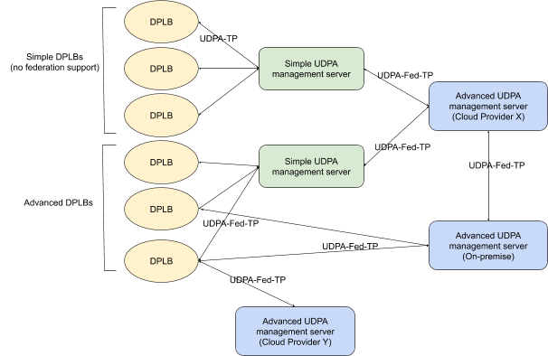
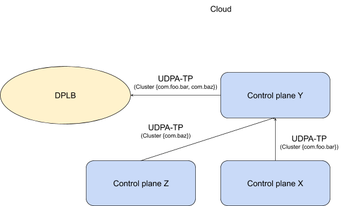
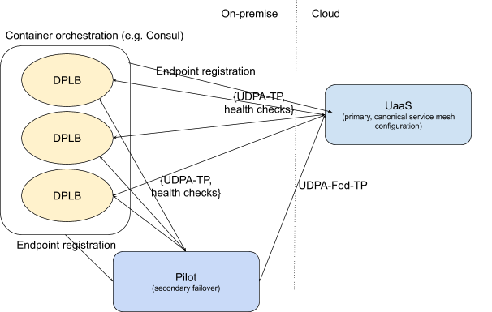
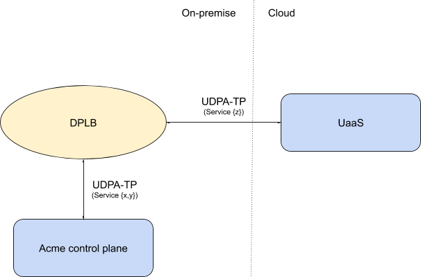

UDPA设计之传输协议

> 翻译自：[UDPA-TP](https://docs.google.com/document/d/1eubmNM2Kynzf7Rpms4nncvTSL6NnANTrpHNWzeIBoZw)

## 概述

Envoy v2 xDS API 当前正在转向通用数据平面API（Universal Dataplane API/UDPA）。重点是将传输协议关注点与数据模型分离。 这也提供了一个机会，可以解决从v2 xDS API 传输协议中的需求和复杂性中学到的许多经验教训。

本文档介绍了用于UDPA的下一代传输协议（UDPA-TP）。 在这一点上，应将其视为仅具有推测性状态，并且其存在是为了帮助推动对话。 我们将UDPA数据模型称为UDPA-DM，这是UDPA-TP的一个正交问题。

关键的设计动机包括：

- 在保留 Core v2 xDS 中存在的概念性pub-sub模型的同时，还在单个框架中支持高级功能，例如LRS/HDS。
- 支持Envoy Mobile和其他DPLB客户端的大规模扩展，我们预计这些有O（数十亿）客户端。这意味着可以操作简单的资源边缘缓存。
- 简单的客户端和简单的管理服务器实现。我们需要客户端实现简单以方便采用，但也要意识到可能会有O(10)生产客户端实现和 >O(100) 生产管理服务器实现。
- 使增量更新资源高效而简单。
- 支持资源联邦。另请参阅https://github.com/envoyproxy/envoy/issues/6909。
- 使API资源的子资源变得简单且实现成本低，并且使其可以增量更新和可联合，而不会破坏向后兼容性或需要任何客户端代码更改。这里的认识是API将继续发展，我们应该使它变得流畅。
- 维护对一致性模型的支持，从最终一致性（eventual）到顺序一致性。
	* v2中存在一些尚需解决的问题；例如更新CDS集群时，尽管EDS资源没有更改，但仍需要发布EDS更新以完成预热。这引入了跨资源耦合。
- 消除v2 xDS奇怪之处：
	* ACK/NACK与订阅消息的合并。在v2 xDS中，DiscoveryRequest既是订阅请求，又是对先前消息的潜在确认。这导致了一些复杂的实现和调试体验。
	* CDS/LDS是与EDS/RDS不同的API层。在v2 xDS中，EDS/RDS是准增量的，而CDS/LDS是最新状态。
- 从概念上讲，在Envoy v2 xDS API 基础上小范围变更。我们不希望对UDPA管理服务器实现者造成重大的概念和实现开销。

为了支持我们的目标，即在支持高级用例的同时降低客户端实现的复杂性，我们在下面提出了两种传输协议： DPLB的基准传输（称为UDPA-TP）和可以支持联盟的超集（称为UDPA-Fed-TP）。

## 术语

- DPLB；data plane load balancer/数据平面负载均衡器。涵盖诸如代理（例如Envoy）或客户端RPC库（例如gRPC和Envoy Mobile）的用例。 DPLB是UDPA客户端。他们负责启动到管理服务器的UDPA流。
- Management server/管理服务器；能够提供UDPA服务的实体。管理服务器可以仅是UDPA服务器，也可以是UDPA客户端和服务器（在联邦的情况下）。

- Federation/联邦;多个UDPA管理服务器的互操作以生成UDPA配置资源。
- Direct federation/直接联盟；当DPLB直接连接到多个UDPA管理服务器并能够从这些流中合成其配置资源时。
- Indirect federation/间接联合；当DPLB一次最多连接一个UDPA管理服务器（对于某些给定的资源类型），并且UDPA管理服务器执行所有与联盟有关的工作时。

- Advanced DPLB/高级DPLB；支持直接联邦的DPLB（需要UDPA-Fed-TP）。
- Simple DPLB/简单DPLB；不支持直接联邦的DPLB，即仅基线UDPA-TP。

- UaaS； UDPA-as-a-service，云托管的UDPA管理服务。

- UDPA；通用数据平面API，其中包括数据模型（UDPA-DM）和传输协议（UDPA-TP）。
- UDPA-TP; UDPA API的基准传输协议。
- UDPA-DM; UDPA API的数据模型。
- UDPA-Fed-DM; UDPA-DM的超集，具有用于联邦的其他资源类型。
- UDPA-Fed-TP;支持联邦的UDPA-TP的超集。

## 资源

在UDPA-TP中，我们根据资源的来源来区分两类资源：

- Configuration resources/配置资源； 这些是由控制平面生成的对象，由管理服务器传递到DPLB。 示例包括运维配置（例如监听器/Listener和集群/Cluster），以及动态运行时资源（例如ClusterLoadAssignment中的端点分配）。
- Client resources/客户资源； 这些是由DPLB生成并打算由控制平面使用的对象。 它们包括诸如负载统计报告和资源状态之类的信息（例如，监听器正在预热，由于缺少SDS TLS证书依赖项而无法监听，处于活动状态等）。

任何资源都具有名称（name），类型（type）和版本（version）。 名称对于给定类型是唯一的。 资源是在proto3中规范定义的，它们的类型是一些proto3类型，由type URL提供的字符串表示形式。 对于给定的命名资源，它可能在不同的时间点具有不同的版本。 例如，ClusterLoadAssignment X最初可以分配给版本0的DPLB，以后的更新将提供版本1。

资源名称是结构化的，其路径层次结构如下：

`<namespace>/<resource>`

命名空间将采用 反转DNS 格式，例如 com.acme.foo ，而资源在很大程度上是不透明的，除非出于按需加载的目的需要命名它们的地方，例如UDPA中的相当于VHDS的资源。资源名称的示例为com.acme.foo/service-a 。 资源命名空间是进行联邦和所有权委派的基础。例如，DPLB可能具有由 Acme Inc. 在 com.acme 命名空间中分发的某些监听器资源，以及由 Blah Inc. 在 com.blah命名空间中分发的其他监听器资源。

UDPA-TP 传输提供了一种在管理服务器和 DPLB 客户端之间传输命名和版本化资源的方法。我们称这些实体为 UDPA-TP 端点。 UDPA-TP 端点可以是客户端和管理服务器，也可以是两个管理服务器（例如，在联邦配置时）。 该图说明了通常可以使用 UDPA 在 UDPA-TP 端点之间传送资源的各种方式，实际用例将具有此拓扑的某些子集，有关更多详细信息，请参见 [示例用户故事](https://docs.google.com/document/d/1eubmNM2Kynzf7Rpms4nncvTSL6NnANTrpHNWzeIBoZw/edit#heading=h.42d303cqmhfw)。



UDPA管理服务器端点可以是简单的(simple)，实际上只是对不透明资源的缓存（几乎不了解UDPA-DM），或者是高级的(advanced)，在这种情况下，它们可能是固有的UDPA-DM感知的非重要配置管道的一部分。 UDPA-TP旨在支持简单的UDPA管理服务器端点的功能，为横向扩展应用提供可扩展的边缘容量，例如 Envoy Mobile。 此好处的另一个示例是，当存在一个复杂配置管道，它了解UDPA-DM，控制平面前端是独立开发的，并且没有直接的UDPA-DM知识。 结果就是，通常假定UDPA管理服务器不具有资源类型或UDPA-DM的语义意识，即简单的UDPA管理服务器仅对不透明资源进行操作。这支持高效的服务，并且随着UDPA-DM的发展，还减少了修改边缘UDPA管理服务器的需求。

DPLB客户也有简单(simple)和高级(advanced)的区别。对于任何配置源，简单的DPLB在任何时间点最多只能与一台管理服务器进行对话。 在故障转移方案中，它们可能会与不同的管理服务器对话，但在任何时间点只有一台用于某些特定配置资源的管理服务器。 高级DPLB将实现对UDPA-Fed-TP的支持，并能够直接作为联邦端点参与。 简单的DPLB将依靠其管理服务器为其实现间接联邦。 简单的DPLB在故障转移方案中仍可能能够与其他管理服务器一起使用，同时保留它们在任何时间点最多与一台服务器通信的属性。

命名资源在UDPA-TP端点之间增量传输； UDPA-TP 端点可以订阅（或取消订阅）来自另一个UDPA-TP 端点的命名资源。 UDPA-TP端点可以将命名资源发布到反向的UDPA-TP端点。

预期有两种形式的资源联邦。 当DPLB为单个资源订阅多个控制平面并负责合并资源时，将发生直接联邦。 当管理服务器代表DPLB执行联邦并负责合并资源时，就会发生间接联邦。

在 proto3 中：

```protobuf
message Resource {
  // 资源的名称，以区别于其他同类型的资源。
  // 遵循反向DNS格式，例如 com.acme.foo/listener-a
  string name = 1;

  // 资源级别版本
  string version = 2;

  // 资源有效负载。
  // 通过 Any 的 type URL 指定资源类型
  google.protobuf.Any resource = 3;

  // 资源的TTL。
  // 此时间段后，资源将在DPLB上失效。
  // 当管理服务器的连接丢失时，将支持资源的优雅降级，例如端点分配。
  // 使用新的TTL接收到相同的资源 name/version/type 将不会导致除了刷新TTL之外的任何状态更改。
  // 按需资源可能被允许过期，并且可能在TTL过期时被重新获取。
  // TTL刷新消息中的resource字段可能为空，name/version/type用于标识要刷新的资源。
  google.protobuf.Duration ttl = 4;
 
  // 资源的出处（所有权，来源和完整性）。
  Provenance origin_info = 5;
}

message Provenance  {
  // 权威资源生产者的标识符。 
  // 这应该是X.509 identity的通用名称。 
  // 在联邦配置中，这使资源创建者和最终所有者变得清晰。
  // 权限管理资源命名空间。联邦时，管理服务器将实现 authz/authn 和 ACL，
  // ACL用来管理哪些命名空间下给定的 UDPA-TP 端点具有权威性。
  // 例如，命名空间 com.acme.foo 中名为 com.acme.foo/service-a 的资源
  // 可能是由权威config.acme.com 生产的。
  // config.acme.com 权威还可以负责 com.acme.bar/listener-a ，
  // 甚至 org.blah/service-a 。
  string authority = 1;
  // 将来，这里还将提供资源完整性签名...
}
```

### 示例数据模型

资源类型的集合提供了UDPA数据模型（UDPA-DM）。 UDPA数据模型是DAG。 尽管 UDPA-TP 仅处理传输级别问题，但使用简化的说明性的示例数据模型来帮助描述UDPA-TP的操作还是很有帮助。

在这里，我们使用 Envoy v2 xDS Bootstrap (B), ConfigSource (CS), Listener (L), RouteConfiguration (R), VirtualHost (VH), Cluster (C) 和 ClusterLoadAssignment (CLA)的抽象描述。 我们使用符号 LX@N  表示版本N的监听器X。

以下是伪 proto3，为简洁起见，我们采取了一些措施，例如 允许重复的字段之一。 如果消息未定义，请参阅 https://github.com/envoyproxy/envoy/tree/master/api/envoy/api/v2 上的 Envoy v2 xDS 定义。

```protobuf
// 指定UDPA管理服务器流端点，例如 gRPC或REST URL。 
// 本质上类似于v2 Envoy xDS ConfigSource，请参阅
// https://github.com/envoyproxy/envoy/blob/master/api/envoy/api/v2/core/config_source.proto.  
message ConfigSource {
  // 与v2 xDS中的ConfigSources不同，UDPA ConfigSources被命名。 
  // 支持ConfigSources的重复数据删除，并归纳了ADS的概念。 
  // 任何共享的ConfigSource都将映射到与v2 Envoy ADS类似的单个共享流。 
  // 每个命名的ConfigSource只会打开一个gRPC流，从而提供类似于ADS的串行化，以实现顺序一致性。
  string name = 1;
  // 这将受益于UDPA对Envoy细节的常规删除。
  … 就像在v2 Envoy xDS中一样 ..
}

// 描述内联或动态ConfigSource。
message ConfigDescriptor {
  oneof {
    // 动态ConfigSource资源名称。 
    // 这是ConfigSource的名称，可以在引导程序的 static_resources.config_resources 中指定该名称。
    string resource_name = 1;
    // 内联ConfigSource.
    ConfigSource config_source = 2;
  }
  
  // 标识此ConfigSource上的任何订阅所使用的资源命名空间。 
  // 这可以用于在全局命名空间的某些特定部分上委派权威，例如 CDS 允许 服务器X 服务 com.acme.foo 层次结构。 
  // 它还可以用于将资源类型划分为不同的类别，例如针对不同的租户。 
  // 此ConfigSource中仅与此名称空间匹配的资源将被接受。 
  // 当命名空间是分发的资源名称的前缀时，确定匹配。 
  // 不匹配的资源将被拒绝，并在资源的回执中导致错误。
  string namespace = 3;

  // 此后是否继续处理这个之后的其他ConfigDescriptor。
  enum ContinuationBehavior {
    // 如果成功，则停止进一步处理ConfigDescriptor。 
    // 后续的ConfigDescriptor涵盖了备份服务器。 
    // 成功被定义为拥有到该ConfigDescriptor的ConfigSource的活动流。 
    // 添加或删除ConfigSource流时，将重新评估ContinuationBehaviors。
    STOP_ON_SUCCESS = 0;

    // 如果发生故障，停止处理其他ConfigDescriptor。 
    // 后续的ConfigDescriptor提供了补充资源，只有在较早版本的ConfigDescriptor成功获取后，这些资源才有意义。 
    //失败被定义为没有活动流。 
    // 添加或删除ConfigSource流时，将重新评估ContinuationBehaviors。
    STOP_ON_FAILURE = 1;
  }
  ContinuationBehavior continuation = 4;
}

// ConfigProvider是配置源的潜在联合集合。
message ConfigProvider {
  // 配置描述符构成流的有序集合，在其上发生给定资源或资源集的订阅。 
  // 配置描述符返回的资源并集构成配置资源。
  repeated ConfigDescriptor config_descriptors = 1;
}

message VirtualHost {
  string name = 1;
  // 例如 foo.com, *.bar.com, *-abc.xyz. 
  // 这些也是VirtualHost的资源别名。
  repeated string domains = 2;

  // 其他VirtualHost相关事物，例如 路由表...
  …
}

message RouteConfiguration {
  string name = 1;
  oneof {
    repeated VirtualHost virtual_hosts = 2;
    DynamicVirtualHosts dynamic_virtual_hosts = 3
  }
  // 其他 RouteConfiguration 相关事物, 例如要添加的header… 
  …
}

message DynamicRouteConfiguration {
  string resource_name = 1;
  ConfigProvider config_provider = 2;
}

message Listener {
  string name = 1;
  // 实际上应该在FilterChain中，但为简单起见，放在顶级。
  oneof {
    RouteConfiguration static_route_config = 2;
    DynamicRouteConfiguration dynamic_route_config = 3;
  }
  // 其他 Listener-y 相关事物, 例如 ports, IP addresses, filter chains … 
  …
}

message LbEndpoint {
  Endpoint endpoint = 1;
  uint32 weight = 2;
  HealthStatus health_status = 3;
}

message LocalityLbEndpoints {
  Locality locality = 1;
  uint32 weight = 2;
  repeated LbEndpoint lb_endpoints = 3;
}

message StaticOrDynamicLocalityLbEndpoints {
  oneof {
    LocalityLbEndpoints locality_lb_endpoints = 1;
    ConfigProvider config_provider = 2;
  }
}

message LocalityEndpointMap {
  // 从区域名到端点的映射
  map<string, StaticOrDynamicLocalityLbEndpoints> locality_lb_endpoints = 1;
}

message ClusterLoadAssignment {
  string name = 1;
  // 列表的索引（index）表示优先级，例如 第一个条目的优先级为0。
  repeated LocalityEndpointMap priorities = 2;
}

message DynamicClusterLoadAssignment {
  string resource_name = 1;
  ConfigProvider config_provider = 2;
}

message Cluster {
  string name = 1;
  oneof {
    ClusterLoadAssignment static_cla = 2;
    DynamicClusterLoadAssignment dynamic_cla = 3;
  }
  LbPolicy lb_policy = 4;
  // 其他 Cluster 相关事务, 例如熔断器… 
  …
}

// 与Envoy v2 xDS一样，我们有一个静态引导程序（bootstrap）配置文件作为DAG的根。
message Bootstrap {
  message StaticResources {
    repeated Listener listeners = 1;
    repeated Cluster clusters = 2;
    repeated ConfigSource config_sources = 3;
  }
  StaticResources static_resources = 1;

  message DynamicResources {
    // Listener subscriptions are to the wildcard resource set “”.
    ConfigProvider listener_provider = 1;
    // Cluster subscriptions are to the wildcard resource set “”.
    ConfigProvider cluster_provider = 2;
  }
  DynamicResources dynamic_resources = 2;

  … 其他 Bootstrap (包括静态资源) … 
}

```


## 安全

在直接联邦的情况下，当DPLB直接与一个或多个管理服务器对话时，UDPA DAG从结构上暗示信任关系。 例如。 如果DPLB从管理服务器X获取了服务配置，并且X希望将为服务 com.foo.bar 提供端点的功能委派给管理服务器Y，则com.foo.bar 的 DynamicClusterLoadAssignment 的 ConfigDescriptor 将指向Y。


也可以考虑使用 ConfigDescriptor 的命名空间对特定资源类型的通配符订阅进行职责分区。 例如，对于集群更新，引导程序可能将命名空间 com.foo.bar 委派给管理服务器X，并将 com.baz 委派给管理服务器Y。

间接联邦将要求联邦中涉及到的中间管理服务器应用安全策略，以控制哪些服务器可以声明为对给定的命名空间具有权威性。在下面的示例中，控制平面X是 com.foo.bar 的权威，而不是 com.baz 的权威，它属于控制平面Z。控制平面Y的责任是应用策略确定并授权此权限关系。



在更高版本的UDPA中，当通过不受信任的管理服务器共享资源时，我们将考虑添加资源完整性签名。

上面的讨论集中在流向 DPLB 的配置资源上。 当 DPLB 产生客户端资源时，在与管理服务器的层次结构共享时，在间接联邦身份验证情况下，这些资源将与配置资源类似地对待。 每个跃点将负责加强命名空间的完整性，并将后续跃点的可见性限制在适当的资源范围内。

## 错误处理

资源可能因为多种原因无法应用于UDPA端点。 我们区分以下两者：

- 立即失败，例如由于 proto3 验证，资源不可用或可快速检测到的特定于资源的语义问题（例如重复的监听器名称）
- DPLB 资源状态，例如 Listener 正在热身。

UDPA-TP更新将为每个资源提供相应的错误详细信息。 它们反映了资源分发的直接失败或成功。 更新中的每个资源都以任意顺序独立应用，并且在将其发布到DPLB之后，UDPA-TP消息回执中将提供错误详细信息。 这涵盖了在短时间内容易检测到的错误类别。

一些资源更新，例如新的监听器，可能需要花费大量时间才能解决。 例如，监听器器可能在 RouteConfiguration 上预热了几分钟。 在 UDPA-DM 中，此类配置资源将具有伴随的客户端资源，这些客户端资源描述了管理服务器可以订阅它们的状态。 例如，将来自管理服务器X的 监听器A 更新到 DPLB Y时，可能会导致从Y到X发送监听器状态A的消息，指示旧监听器A和新监听器A的热身，逐出和活动状态。如何工作的更多详细信息 在UDPA-DM中提供。

## 传输

### gRPC

UDPA-TP的 gRPC 传输是UDPA-TP端点之间的双向流，UDPA-TP端点可以在其上发布或订阅资源。它基于v2 Envoy xDS 增量 xDS 协议。 UDPA客户端订阅资源时，它订阅的是诸如监听器之类的配置资源。这与v2 Envoy xDS基本相同。

与v2 Envoy xDS不同，UDPA流现在是对称的，并且管理服务器UDPA-TP端点也可以订阅资源。这有助于重用针对其他v2 xDS协议（例如LRS或HDS）的UDPA配置资源的pub-sub机制。例如，考虑LRS协议。在此模型中，DPLB将收到LRS元数据消息，其中包含诸如集群定义中的负载报告间隔之类的信息，并且它将使用 ClusterStats 发布 LRS 更新。这标准化了对所有UDPA资源传输的处理，并允许管理服务器保持粘性，例如 Envoy v2 EDS 和 LRS 的逻辑等效项都可以固定在同一服务器上。这也支持间接联邦，例如允许管理服务器使用UDPA-TP彼此交换DPLB的负载报告状态和健康检查。

下面提供了gRPC服务定义。这可以在包括DPLB在内的任何UDPA-TP端点上实现。这支持两种拓扑：管理服务器向DPLB客户端启动UDPA流，以及连接到管理服务器的DPLB客户端的v2 xDS方法。建立流后，它实际上将是完全双向且对称的。

```protobuf
service UdpaDiscoveryService {
  rpc StreamMessages(stream UdpaMessage) returns (stream UdpaMessage) {}
}
```

UDPA消息的基本顺序是“订阅-发布-回执(subscribe-publish-receipt)”。 这在标准pub-sub模型中增加了一个附加阶段，在该阶段中，接收已发布资源的端点可能会指示其资源的成功应用或发生资源失败的地方。 只有某些形式的pub-sub要求回执，例如客户资源总是被管理服务器接受，不需要回执。 同样，在执行间接联邦的管理服务器之间交换配置资源通常不需要回执。

```protobuf
message Subscribe {
  // 被请求资源的类型
  // 例如 "type.googleapis.com/envoy.api.v2.ClusterLoadAssignment"..
  string type_url = 1;
  // 资源订阅与下列地址中的相同： 
  // https://github.com/envoyproxy/envoy/blob/32bfd01da2a95c51e4ae18d134449ceb0123efb8/api/envoy/api/v2/discovery.proto#L145.
  repeated string resource_names = 2;

  // 仅用于重新连接时的第一个订阅，并且是可选的，以在资源源（source）和接收器（sink）上都得到支持。 
  // 如果提供的话，它使资源源（source）能够避免 state-of-the-world/ 全量的初始发布。 
  // 严格来说，这是一种优化。
  map<string, string> initial_resource_versions = 3;
  // 资源命名空间是 UDPA 在 v2 Envoy xDS 之外提供的一个新概念。 
  // 它提供了进一步区分给定类型的资源类别的能力。 
  // 设置后，它支持给定资源命名空间正在被订阅的概念。 
  // 在资源命名空间中，某些资源可能会急切地推送，而其他资源则可能按需加载。 
  // 使用它的一个示例是等效于 CDS/LDS 的 UDPA，当订阅通配符资源集""时，所有资源都是非延迟的，并且会急切地推送。 
  // 与VHDS等效的UDPA 则区分了不同类别的虚拟主机，这些虚拟主机可以通过延迟获取和立即推送的组合进行加载。 
  // 所有已发布资源必须在此命名空间内。
  string namespace = 4;
}

message Unsubscribe {
  // 被取消定于的资源的类型
  // 例如 "type.googleapis.com/envoy.api.v2.ClusterLoadAssignment".
  string type_url = 1;

  // 一组先前已订阅或在发布消息中传递的资源，UDPA-TP端点已经不再对他们感兴趣。
  repeated string resource_names = 2;
}

message StateOfTheWorldPublish {
  // 在UDPA-TP端点设置的资源。
  repeated Resource resources = 1;
  // 唯一标识此发布消息的随机数，用于回执
  string nonce = 2;
  // UDPA端点是否应发送回执消息，以确认已接收到此消息。
  bool receipt_required = 3;
}

message DeltaPublish {
  // 在UDPA-TP端点上添加/更新的资源。
  repeated Resource resources = 1;
  // UDPA-TP端点应删除的资源的资源名称。
  repeated string removed_resources = 2;
  // 唯一标识此发布消息的随机数，用于回执
  string nonce = 3;
  // UDPA端点是否应发送回执消息，以确认已接收到此消息。
  bool receipt_required = 4;
}

message Receipt {
  // 对应各自的发布消息。
  string nonce = 1;
  // 发布消息的 resources 字段中每个条目的 error_detail。
  repeated google.rpc.Status error_detail = 2;
}

message UdpaMessage {
  oneof {
    // 订阅给定类型的某些资源
    Subscribe subscribe = 1;
    // 取消订阅给定类型的某些资源
    Unsubscribe unsubscribe = 2;
    // 发布某些资源。
    // 资源的始发者和中间 UDPA-TP 端点都使用它来传播资源。
    Publish publish = 3;
    // 某些发布消息的确认
    Receipt receipt = 4;
  }
}
```

当 DPLB 打开 UDPA 流时，DPLB 将在发生任何其他活动之前将 Node 消息发布到管理服务器。 这将包括客户端功能和身份。 以TBD方式，管理服务器将使用它来将分发的资源与客户端的能力进行匹配。

### REST

TODO（htuch）：与v2 Envoy xDS类似，这将仅支持配置资源的最新状态，而非流式获取。 客户端资源（例如LRS ClusterStats）将不被支持。

### 文件系统

这将类似于v2 Envoy xDS 文件系统订阅，即基于inotify的全量更新机制，无法支持增量更新，回执或协议（例如LRS / HDS）。 它旨在用于简单的应用，例如与节点代理进行互操作，以进行小规模配置更新或在测试基础设施时。

## 示例用户故事

下面我们提供一些示例方案，其中 UDPA-TP 被配置为解决具体的运维注意事项。

### 联邦

此处详细说明了联邦设计的全部目标。 下面，我们以一些说明性的具体示例为例，并提供UDPA-TP示例。

### 故障转移

Acme Corp.使用Cloud UDPA-as-a-service（UaaS）存储其服务网格配置的规范表示。 UaaS负责管理服务配置，端点注册和健康检查。 在常规运维中，位于Acme内部场所的所有DPLB都将UaaS用作其控制平面。

Acme担心其本地位置的网络连接中断可能导致UaaS无法访问。 尽管在那种情况下DPLB可能会继续在数据平面上转发，但DPLB的端点配置将很快失效。 这是因为Acme具有高度动态的环境，在该环境中，容器不断启动和关闭。

Acme将UaaS配置为主控制平面，然后用本地控制平面，例如Istio的Pilot，作为故障转移。 UaaS继续提供规范的服务网格数据模型。Pilot从UaaS接收到UDPA-DM的联邦反馈，以用于故障转移。 UaaS和Pilot都将持续对DPLB进行健康检查，从而支持无缝故障转移和恢复。

在故障转移期间，将无法添加或删除服务，但是在已建立的服务中，端点可能会来来去去。端点注册不是由DPLB执行，而是由容器编排系统执行。 DPLB端点注册通常不是 UDPA-TP 或 UDPA-DM 的问题。但是，在故障转移恢复期间，必须使Pilot 用端点状态更新UaaS，并且面向联盟的  UDPA-Fed-{TP,DM} 会在恢复期间提供端点信息。

UDPA-TP 引导程序中的根 ConfigProviders 将列出 [UaaS，Pilot] ConfigSources。该用例具有非常粗糙的联邦，其中在任何时间点都只有一个权威控制平面。既有间接联邦，也有直接联邦。Pilot执行服务配置的间接联邦。可以将DPLB视为执行直接联邦或控制平面故障转移。联邦是如此粗糙，以至于任何一个观点都是有效的。



### UaaS 迁移

Acme Corp.建立了内部服务网格，带有自定义控制平面的。 但是，自从最初的开发以来，Cloud UaaS已经变得越来越有能力并且能够满足许多Acme服务网格的需求。 Acme希望逐步将服务从其内部服务网格迁移到UaaS。

内部服务网格上的开发工作已经冻结，并且将不支持与Cloud UaaS提供商的联邦。 在这种情况下，只能进行直接联邦。 DPLB将配置为同时处理内部控制平面和UaaS。 内部控制平面对一组服务具有权威性，而UaaS对不相干的一组服务具有权威性。



......

> 这个user story 有点乱，不细看了。

## 公开问题

这些是我们需要解决的上述关键开放问题：

- 我们是否要坚持使用类似于ADS的语义以实现比最终一致性更强的功能，还是应该向资源添加资源名称/版本依赖性，以提供分布式一致性解决方案？
- 客户端→管理服务器不关心端点注册，但是UDPA的管理服务器联邦关心，例如对于故障转移恢复。 这引入了资源来源/所有权的概念，例如 让UaaS了解历史。

## 下一步

- 将 UDPA-TP 稻草人分发给 UDPA-WG。 在2019-8-1会议上讨论。
- 在 https://github.com/cncf/udpa-wg 中创建 proto 的GitHub版本。 建立测试客户端/服务器原型以使用各种用例。

## 未来工作

上面的建议为初始 UDPA-TP 提供了一个稻草人。 在以后的版本中，我们可能要考虑许多当前未处理的功能。 这些包括：

- 资源完整性签名，用于通过不受信任的管理服务器跃点共享资源时
- 当UDPA-TP端点不知道给定的订阅主题（type URL或 命名空间）时，订阅失败。
- 可能需要在子命名资源级别添加资源合并，作为客户端的可选功能。
- 根据v2 xDS的资源别名。 这是一项优化措施，旨在提高VHDS资源的可缓存性。
- 调试信息，例如资源的传递路径。
- 路由信息，如资源的紧迫与延迟。


