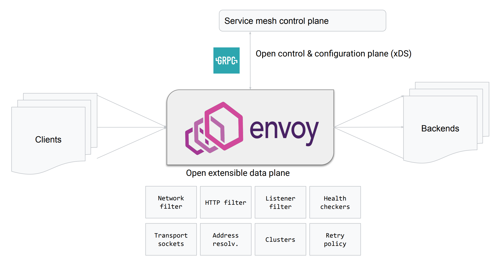
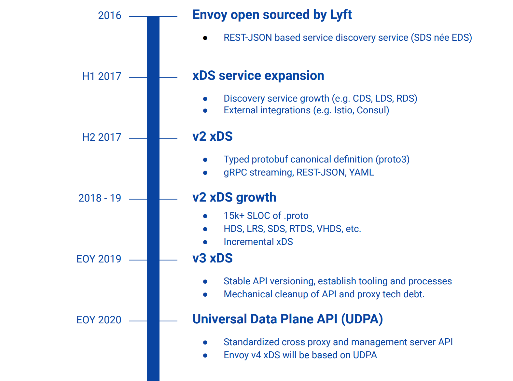
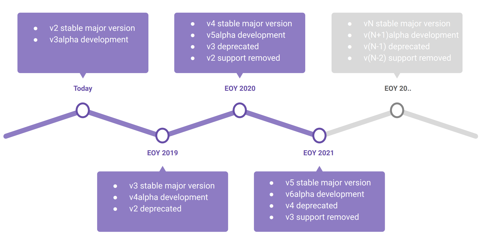

### 演讲背景

The Universal Dataplane API (UDPA): Envoy's Next Generation APIs

https://envoycon2019.sched.com/event/UxwL/the-universal-dataplane-api-udpa-envoys-next-generation-apis-harvey-tuch-google

演讲者：[Harvey Tuch](https://github.com/htuch),  envoy的contributor，来自 Google

PPT下载地址：[https://static.sched.com/hosted_files/envoycon2019/ac/EnvoyCon%20UDPA%202019.pdf](https://static.sched.com/hosted_files/envoycon2019/ac/EnvoyCon UDPA 2019.pdf)

以下为PPT内容摘要。

### Envoy as a Platform

### The evolution of xDS

### Envoy 版本控制目标

目标1: 保证protobuf wire和语言绑定的稳定性

* 生态系统已从1个增加到 O(100?) 个管理服务器
* 要求严格遵守protobuf wire 规则 ++
* API只能增加；不可删除或修改

目标2：消除Envoy的技术债务

* 需要在某些时候删除字段和API概念
* 如何在不违反目标（1）的情况下做到这一点？

	- 结论就是需要一个 “xDS API的强力版本控制”。

目标3: API大规模发展

* 15k+ proto和1k+ Envoy代码参考
* Protobuf插件
* 基于Clang工具的自动化
* 其他客户端/服务器的设计模式

### Envoy version support timeline

总结：

1. 一年一个大版本：v2 -》 v3 -》v4
2. 每个大版本都要经历 alpha -》 stable -》deprecated -》removed 四个阶段
3. 稳定后envoy会同时有三个API大版本：正在使用的稳定版本，已经弃用的上一个稳定版本，准备开发的新的下一个alpha大版本

### 稳定API版本控制

缩减版本：https://github.com/envoyproxy/envoy/blob/master/api/API_VERSIONING.md

完整版本：https://docs.google.com/document/d/1xeVvJ6KjFBkNjVspPbY_PwEDHC7XPi0J5p1SqUXcCl8/

### UDPA目标

* Next generation transport protocol / 下一代传输协议
	- Generic bidi pub-sub, no special casing for APIs like LRS / 通用的双向 pub-sub，对于LRS之类的API没有特殊的外壳
	- Federation / 联邦
* Decouple Envoy specifics from the data model / 将数据模型与Envoy细节解耦
	- Generic and modular proxy specific aspects / 通用和模块化代理特定方面
* Tackle technical debt / 解决技术债务
	- E.g. routing matchers, xDS weirdness / 例如 路由匹配器，xDS怪异
* Compliance tests / 符合性测试
* Reference implementations independent of Envoy / 独立于Envoy的参考实现
* UDPA-WG discussion and validation of API concepts / UDPA-WG讨论和API概念验证