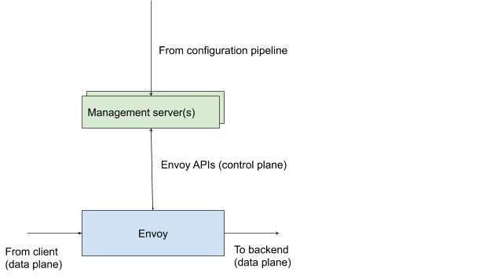

> 内容来源：https://docs.google.com/document/d/1xeVvJ6KjFBkNjVspPbY_PwEDHC7XPi0J5p1SqUXcCl8/

## 概况

本文档提供了解决Envoy API稳定性问题的设计建议，以及有关API当前状态的背景知识，考虑的替代方法以及对Envoy API的未来发展方向的讨论。

可以从 https://docs.google.com/document/d/1HPe-4Fcr5panEjhhKHoByw0NnRGzjDdi0BcC8A2T9Sw/ 获取该文档的缩写版本。

## 背景

### Envoy xDS APIs

当前现有的 Envoy API 通常被称为xDS API。 这些API源自 Envoy 的v1 API，并提供了向Envoy节点提供动态配置的功能。配置包括服务发现，路由表，监听器配置，负载均衡分配和安全。 https://blog.envoyproxy.io/the-universal-data-plane-api-d15cec7a 和 https://blog.envoyproxy.io/evolving-a-protocol-buffer-canonical-api-e1b2c2ca0dec 提供了有关API历史记录和未来方向的详细信息 ，下面我们总结了一些历史，然后详细描述了今天的Envoy v2 API的组成。 我们还将讨论有关 protobuf wire 和语义兼容性的现有方法的更多详细信息，以帮助建立上下文。



### 历史

Envoy的v1 xDS API 使用轮询 (polling) REST，并在JSON模式中提供规范描述。它们随着代理的发展而演变，其用例变得更加复杂和多样化。这些API涵盖了当今xDS中存在的许多核心功能，例如服务发现。单向轮询的局限性和JSON中缺少类型导致 Google 和 Lyft 努力开发v2 xDS API。

v2 xDS API使用proto3为Envoy的所有静态和动态配置提供规范的定义。由于存在从proto3→JSON和JSON→YAML的机械转换，因此还可以将JSON＆YAML作为配置语言来支持，同时在proto3中为API定义维护唯一的真实来源。 v2 xDS API还基于双向gRPC流作为基本原语而构建。由于大多数v2 xDS核心功能本质上都是pub-sub，因此也可以提供REST和文件系统pub-sub服务。某些v2 xDS API充分利用了双向gRPC流，例如Envoy的Health Discovery Service；仅作为gRPC支持。

### 分类
如今，Envoy中的核心 pub-sub 样式xDS API是：

- *Cluster Discovery Service (CDS)*；服务发现，即存在哪些服务（在Envoy中称为Cluster）及其配置。
- *Endpoint Discovery Service (EDS)*；集群中服务器的负载均衡分配和权重。
- *Listener Discovery Service (LDS)*; 监听器配置，包括端口绑定和L4/L7过滤器链配置。在此处设置不透明的特定于过滤器的配置。在不久的将来，过滤链发现服务（FCDS）xDS API可能会进一步分解它。
- *Route Discovery Service (RDS)*； L7服务的路由和虚拟主机配置。在不久的将来，虚拟主机发现服务（VHDS）xDS API将进一步分解此问题。
- *Secret Discovery Services (SDS)*；监听器和传出连接的证书和密钥。支持动态证书轮换。

这些API是独立的，并且可能涉及到Envoy控制平面上的服务器的许多连接。他们是最终一致的。为了提供更强的一致性保证，xDS还提供了一个多路复用服务，称为 Aggregated Discovery Service (ADS)，用于组合一个或多个pub-sub xDS API。这些消息与上述pub-sub API相同，但是它们是从单个管理服务器通过单个流传递的。提供有序的消息传递功能。

上述动态配置也可以静态表达。 Envoy在启动时会获取 bootstrap proto3 /JSON/YAML配置文件，并提供一些初始配置，例如如何找到管理服务器，节点身份等。引导程序（bootstrap）可能还可以包含任何 xDS API 可交付的资源。 引导程序配置与Envoy的xDS API共享protobuf消息定义。

当今的 xDS pub-sub API 处于世界领先水平。 这带来了可伸缩性方面的挑战，并且正在积极努力添加增量xDS支持，包括基于 wire-level 差异更新的xDS（增量xDS/delta xDS）和延迟加载（按需xDS/on-demand xDS）。

除了pub-sub样式的API外，还有其他双向的仅限gRPC的xDS（和其他）API，这些API允许Envoy充当数据提供者：

- Load Reporting Service (LRS)； 定期向控制平面报告每项服务和本地负载，支持负载平衡分配中的反馈。
- Health Discovery Service (HDS)； 任意节点的健康检查分配和健康检查报告状态，从而解决了服务网格中的O(n^2) 健康检查问题。
- Rate Limiting Service (RLS)； L4和L7速率限制检查。

RLS 只是 Envoy 附带的，位于 `envoy.*` 包命名空间下的扩展提供的诸多API的一个例子。 其他示例包括用于外部授权，访问日志，TAP和指标的gRPC服务。 虽然一般来说应该如何确定扩展的API超出了本文档的范围，但是Envoy附带的API应该具有与核心一致的版本控制策略。

Envoy的xDS API是其与控制平面交互和配置下发的基础，但它们并不是Envoy定义的唯一API，而且与其在给定系统中的兼容性有关。 如上所述，bootstrap配置与xDS API共享定义。 其他服务（例如RLS或外部授权）也与xDS共享protobuf定义。 甚至可以说，即使是Envoy的管理控制台（过去一直是支持 curl 的文本界面），现在也为其JSON格式提供了protobuf API定义，并且是Envoy API的一部分。 从这一刻起，我们将所有这些API（包括消息和服务定义）都称为“ Envoy API”，以面对需要版本控制的API不仅限于xDS的事实。

### 包

下面，我们为Envoy的API树提供了带注释的文件系统布局。 由于 proto 包名称空间反映了文件路径，例如 `envoy/api/v2/core/base.proto` 位于包 `envoy.api.v2.core` 中，这体现了Envoy API包层次结构：

```
config  # Bootstrap and opaque extension configuration 
|-- common
|   |-- tap
|       |-- v2alpha
|-- grpc_credential
|   |-- v2alpha
|-- ratelimit
|   | -- v2
…
|-- accesslog
|   |-- v2
… 
|-- filter
|   |-- http
|   |   |-- ext_authz
|   |       |-- v2
|   |-- jwt_authn
|   |   |-- v2alpha
… 
|   |-- network
|   |   |-- mysql_proxy
|   |   |   |-- v1alpha1
… 
|-- bootstrap
|   |-- v2
data  # Data formats for data that Envoy produces
|-- tap
|   |-- v2alpha
|-- accesslog
|   |-- v2
|-- core
|   |-- v2alpha
… 
admin  # Admin console JSON pseudo-schema via proto3 
|-- v2alpha
type  # Core types (the new home of universal parts of envoy.api.v2.core)
|-- matcher
service  # Service definitions (older services, e.g. CDS are in envoy.api.v2) 
… 
|-- ratelimit
|   |-- v2
|-- accesslog
|   |-- v2
… 
|-- load_stats
|   |-- v2
|-- discovery
|   |-- v2
api  # Core xDS pub-sub APIs (mostly)
|-- v2
    |-- auth
    |-- ratelimit
    |-- endpoint
    |-- core
    |-- listener
    |-- route
    |-- cluster

```

当前的布局反映了一定程度的发展，特别是我们已经从管理整个API的历史的 `envoy.api.v2` 命名空间划分为具有其自己的包命名空间级别版本控制方案的多个子API。例如，`envoy.config.grpc_credential.v2alpha` 是独立于 `envoy.data.accesslog.v2 API` 的API。

Envoy API实际上是API的集合，它们相互引用为DAG。它们通过其protobuf 包命名空间进行版本控制，例如 `envoy.service.accesslog.v2`。如今，只有v2用于稳定的API，而版本v2alpha，v2alpha1，v1alpha1等则用于实验性API或新API。

剩下的是一些驻留在诸如 `envoy.type` 或 `envoy.api.v2.core` 之类的位置中的核心类型。Root是宏消息，例如 bootstrap 配置或集群定义。如下一节所述，自v2 xDS API诞生以来，这些API的字段已添加和删除。

在随意交谈中，我们谈到“ v2 xDS API”，实际上，API家族有多个有效版本。今天，不可能仅基于wire内容知道给定的 proto3/JSON/YAML对象引用哪个API，这必须与该对象所针对的Envoy版本结合使用。

### 弃用

字段可以自由添加到现有的v2 API中。 Envoy还允许根据其重大更改策略删除字段。 这使用Envoy发布周期作为时钟。 Envoy每季度发一次版本，当前版本为1.10.0。 下面的逐字相关要点描述了关键限制：

- 在两个发布周期之后，我们保留废弃配置的权利。例如，在标记和发布1.5.0之后（1.6.0发行周期的开始），在1.3.0和1.4.0之间的所有弃用都将被删除。这将导致三到六个月的时间，从弃用的代码路径迁移到新的代码路径。

- 除非社区和Envoy维护团队就异常达成共识，否则在某个功能被废弃之后的第一个发行周期内，使用该功能将导致记录警告，并增加 `runtimeruntime.deprecated_feature_use stat`。在第二个发行周期中，使用弃用配置将导致配置加载失败，除非在运行时配置中明确覆盖了所关注的功能。最后，在第三个发行周期中，代码和配置将被完全删除。

- v2命名空间中的配置字段或消息不得被弃用，除非有相应的语义等效项可替代它。试金石（litmus）测试假象存在一个无状态转换工具，该工具可以从早期的API转换为新的API。如果此工具将能够执行转换，则可能弃用该字段。例如，如果要引入一个更全面的HTTP/2协议选项字段来替换该字段，则删除描述HTTP/2 window设置的字段是有效的。

- 对于上述语义替换策略未涵盖的配置弃用，仅在至少两个Envoy发布周期（约6个月）内，在就邮件列表Slack和GitHub进行社区咨询之后，才进行任何弃用。如果某项功能被彻底删除却又没有替换，那么在删除之前，将另外有两个Envoy发布周期（约12个月）。

弃用被添加到 https://github.com/envoyproxy/envoy/blob/master/DEPRECATED.md ，并使用protobuf 的 deprecated 注释进行标记。

### 试验性特性

实验性API消息可以自由修改。 这些必须位于 alpha 包命名空间中，例如 v2alpha1或应用了protobuf comment 注释，即 [#not-implemented-hide:], [#not-implemented-warn:], [#proto-status: draft] or [#proto-status: experimental]。

这些注释对于文档目的很有用，但是由于有时将它们应用于服务定义，有时甚至是消息，因此不能为确定实验内容提供完全机械的解决方案。 在某些情况下，它们被完全跳过了，取而代之的是替代了新的和实验性的社区民俗知识，这些都应视为违反政策。

### 兼容性

作为一个项目，Envoy在采用 protobuf/JSON/YAML API 的组合支持时经历了学习过程，如https://blog.envoyproxy.io/evolving-a-protocol-buffer-canonical-api-e1b2c2ca0dec 所述。 随着时间的流逝，我们对API的更改提出了以下限制，以避免破坏兼容性。

主要遵循Google的内部最佳做法，但技术上更加严格：

- 移除字段必须遵循上述弃用日程。
- 字段不能重命名，重新编号或更改其类型。
- 不允许从单例升级为重复，因为这在 JSON/YAML格式中是重大（breaking，破坏）更改。
- 字段编号无法重新分配。
- 枚举默认值应设置为 UNSPECIFIED 的值或不会更改的值。
- 包和proto路径必须保持稳定，因为它们会影响类型URL和服务定义URL。

有关Envoy API更改的完整规则，请访问https://github.com/envoyproxy/envoy/blob/master/api/STYLE.md#api-style-guidelines 

### 需要提高API的稳定性

尽管上述API的发展对于使 Envoy 及其xDS API在动态可重新配置的数据平面代理和负载均衡器方面处于最佳状态，具有重大影响，但目前有许多动机可以加强对API版本控制的限制并提高稳定性。

### Universal Data Plane API

Matt Klein 在 https://blog.envoyproxy.io/the-universal-data-plane-api-d15cec7a 上介绍了通用数据平面API的提案。Envoy的API包含许多数据平面代理或LB在其配置中所需的众多信息。 具体来说，即使对于Envoy的v1 xDS API，其他代理（例如Nginx）也已编写适配器层以使用此信息，以便在Istio网格中透明地替换Envoy。

Envoy的API的愿景是使其成为L4/L7数据平面配置的事实标准，类似于SDN中L2/L3的OpenFlow所扮演的角色。 从硬件负载均衡器到移动客户端的所有内容都可以通过Envoy API进行编程。 为了实现此目标，API需要在版本控制方面变得更加明确，并且不依赖于从Envoy发布周期中得出的隐式信息。


除Envoy之外，第一个包含适合其愿景的xDS API子集的大型项目是gRPC-LB。 gRPC-LB团队正在积极努力，用CDS，EDS，ORCA和LRS替换其专有协议。 我们期望Envoy Mobile（一个来自Envoy代理的客户端库）将成为使用xDS的客户端负载平衡的第二个示例。

### Envoy 管理 SaaS

传统上，Envoy由企业和云服务提供商部署，可以使Envoy版本和控制平面相对于版本保持相对锁定，但现在这种情况正在改变。由于Envoy在行业中的采用，现在已经有Envoy管理即服务的商业提供商。其中包括Google的Traffic Director和AWS App Mesh。

Envoy管理服务需要为Envoy节点的异构队列提供服务，仅对支持的版本进行粗粒度控制（例如，不再支持<X.Y.Z 的版本）。在受支持的版本范围内，需要支持API的所有变体，其中涉及版本发现。这些管理服务将来可能还会面向非Envoy xDS使用者，因此需要具有与此版本兼容的版本控制故事。

管理服务还需要能够在现有API上推出新字段。今天，Envoy默认情况下会拒绝所有未知字段，因此如果不进行进一步的版本协商，这是不安全的。随着我们努力减轻CVE-2019-9901的影响，这一点最近引起了人们的关注。

### Envoy社区成长

另一个促成因素的是Envoy社区的显着增长。现在，我们拥有多个控制平面库（java-control-plane，go-control-plane），服务网格（Istio，AWS App Mesh）以及许多自定义集成，如最近的EnvoyCon 所见证的那样。

在xDS开发的早期，我们可以合理地猜测API中弃用或其他重大更改的影响。这不再是合理的。

除了社区发展之外，其他API（主要是Istio API）在某种程度上还来自Envoy API的功能。在Istio的请求下，最近一次弃用 bind_to_port 的尝试被延迟，以为它们提供时间来适应此更改。

社区增长如何影响API的另一个例子是对实验功能的事实依赖。一些功能，例如外部授权，长时间处于alpha状态。这导致采用者在生产系统中依赖它们。结果，由于Envoy和控制平面的非原子展开，从alpha到稳定的迁移在运维上存在问题。社区将在实际工作中使用Envoy及其控制平面，而不是预期的工作方式。

## 设计

### 定义

- 数据平面负载均衡器（DPLB）； 是一个Envoy代理或另一个数据平面组件（例如gRPC-LB客户端），它使用Envoy的xDS API，引导程序和/或通过xDS提供数据。
- 通用数据平面API（UDPA）； Envoy以外的客户使用的Envoy API。
- Envoy API； https://github.com/envoyproxy/envoy/tree/master/api 中所有版本化的软件包命名空间。

### 需求

基于上述限制，社区讨论和来自 gRPC-LB 和 Traffic Director 的建议，这是一组需求：

- Envoy API应该以不断增长的DPLB的需求为指导。

- Proto3，JSON和YAML 向后和向前兼容性。 对于给定的API版本，较早的配置对象必须是可解析的，并且必须由较新的DPLB接受，反之亦然。 这并不意味着语义兼容。 例如，较旧的Envoy可能会默默地忽略较新的字段。

- 语言向后兼容 C/C ++，Go，Python和Java。对给定API版本的更改，不得在支持的语言编写的任何代码中对 protoc 生成的 stub 引入重大变更。 这些语言列表反映了对Envoy的需要，比如著名的xDS控制平面和gRPC-LB。 将来，语言的列表可能会扩展，但是现在通过确保与多种语言的兼容性，很可能不会有太多的惊喜。

- 这些API必须以不同的功能支持计划来支持DPLB，这些DPLB会在不同时间引入对新API版本和给定功能内功能的支持，并分别弃用其对API版本的支持。

- 在一段有限的时间后，应将实验性API 提升为 stable 或者 去除。

- 包中的版本命名必须一致并遵循以下模式：(envoy|udpa).foo.bar.vN[alpha[M]]

### 提案

提议实际上是针对 Envoy 和 Universal Dataplane API 改编https://cloud.google.com/apis/design/versioning 。 这在很大程度上呼应了gRPC-LB和至少一个管理服务器供应商的现有建议。 本文档描述了它如何映射到具体的Envoy API概念。

### Envoy & Universal Dataplane API 实现

#### Package namespaces

每个版本化的proto 包命名空间（例如 envoy.api.v2，envoy.service.ratelimit.v2）将具有一个独立的主版本号，只要进行向后不兼容的更改，该主版本号就会增加。 引用xDS API的v2甚至vN将不再有意义，因为每个包名称空间将独立发展。

`udpa.*` 命名空间中的包将对所有DPLB通用。 其他名称空间将保留给特定的DPLB。 对于Envoy特定的API，最初仅是  `envoy.*`。 实际上现有通用的 `envoy.*` proto 将通过多个主要版本迁移到 `udpa.*`。 这是一个有方向的意图，可以预料这将不是一个瞬时过程。 非EnvoyDPLB可能需要继续使用 `Envoy.*`。

#### Service 定义

理想情况下，主版本反映在gRPC和REST endpoint URL中，从而允许客户端通过尝试建立流来检测对给定版本的服务器支持。 Envoy中有两种类型的服务定义： 简单和复合。 简单的服务定义可直接定义服务，例如 限速服务。 现有的复合定义是ADS。

对于简单的服务定义，由于服务定义的包命名空间还捕获了流式消息的命名空间，因此更新包版本足以更新gRPC端点。 从 `envoy.service.ratelimit.v2` 移到 `envoy.service.ratelimit.v3` 会将端点从 `/envoy.service.ratelimit.v2.RateLimitService/ShouldRateLimit` 更改为 `/envoy.service.ratelimit.v3.RateLimitService/ShouldRateLimit`。

REST定义需要特别注意，因为它们在HTTP注释中包含显式版本字符串，例如

```proto
service ListenerDiscoveryService {
 rpc StreamListeners(stream DiscoveryRequest) returns (stream DiscoveryResponse) {

 }
 rpc FetchListeners(DiscoveryRequest) returns (DiscoveryResponse) {
   option (google.api.http) = {
     post: "/v2/discovery:listeners"
     body: "*"
   };
 }
}
```

对于像ADS这样的复合服务，服务定义不太可能根据传输的资源而更改，因为ADS 是仅根据 DiscoveryRequest 和 DiscoveryResponse 消息进行定义。每个被多路复用的API，例如 LDS和其他一些xDS，可能是不同的版本。 虽然 DiscoveryResponse的 type URL 将标识返回资源的主要版本，但服务器无法协商客户端的已知版本。

有两种方法可以解决此问题：

1. 为了在这种情况下提供更精细的版本控制，DiscoveryRequest 资源将增加一个字段，该字段为每种请求资源类型提供受支持的客户端主版本。

2. 我们可以强制属于复合API的所有构成xDS API都保存在与ADS服务定义相同的包命名空间中。 今天，ADS和SDS定义位于 `envoy.discovery.v2` 中，而大多数顶级xDS资源都位于`envoy.api.v2` 中。

在下面的实现部分，我们假设（1）。

#### 不透明扩展配置

诸如监听器消息中嵌入的L4/L7过滤器之类的扩展与复合服务定义有类似的问题。 就监听器的包命名空间而言，它们是不透明的，因为它们表示为 Struct 或 Any 消息。

#### 语义版本控制和功能发现

云版本控制策略规定使用次要（minor）和补丁（patch）级别的语义版本控制来指示向后兼容的更改。 它不包含在包命名空间中，但应在配置或服务请求中捕获。 这对于允许管理服务器知道客户端将实际支持哪些字段很有用。

DPLB面临更普遍的问题。以负载均衡策略为例。一些DPLB仅支持 round-robin ，其他一些则支持Envoy的全部负载均衡器，此外可能支持除子集负载均衡器之外的其他所有功能。为了考虑到这一点，有几种选择：

1. 管理服务器可能知道所有客户端的功能，并且客户端使用 user agent 字符串向服务器标识。当与UDPA一起使用的DPLB相对较少时，这很好用，这在今天是正确的，并且在中期也可能适用。

2. 客户端可以在流建立时为给定的API提供功能支持集。这可以像客户端在流建立时提供的众所周知的受支持功能的重复字符串列表一样简单。

3. 类似于Java ME/SE/EE的概念，可以创建不同的DPLB API配置文件。如果没有一组有代表性的DPLB来驱动该过程，可能很难做到这一点，并且有可能使需要支持的Protos和API数量激增。

4. 可以将单个API的功能集配置文件组合成众所周知的配置文件，这些配置文件由客户端提供给管理服务器。这本质上是（1）的有界变体。

基于迄今为止的各种讨论，将采用以下API的设计原则和实现选择：

1. 在合理的情况下，API（及其客户端）将在主版本（major）中添加。也就是说，如果添加了新功能，它将占用一个新的 proto 字段。如果新功能替换了主版本中的旧功能，则客户端（例如Envoy，gRPC-LB）将能够接受这两种配置并优先选择新配置。如果违反了此原则（4），则提供逃生舱口。

2. API的完整语义发布版本将由客户端提供给管理服务器，以供参考。这将作为.proto选项提供，并且任何具有 proto stub 的客户端都可以通过编程方式进行访问。

3. 客户端会将 user agent 字符串（包括客户端版本）提供给管理服务器，以提供信息，客户端分类和错误兼容性。识别并解决错误后，各个客户不可避免地需要一定数量的特殊字符。不应将其用作API服务中重大分歧的基础或本身就是功能发现机制。可以使用广泛的 user agent 信息（例如Envoy与gRPC-LB）来了解客户端类型是否与管理服务器的客户期望的位置相匹配（例如，如果客户有他们只想要的策略）以支持网格中的 lookaside LB）。

4. 如果用（1）对新功能进行建模是不合理的，则客户端将在流建立时向API主版本中众所周知的功能的管理服务器提供重复的字符串列表。这些将在Envoy和Universal Dataplane API存储库中的文本文件中标准化，并遵循反向DNS格式。

#### Alpha 和 experimental APIs

稳定的API proto 将不能引用不稳定的API，例如 envoy.api.v2 中的内容不允许引用envoy.data.tap.v2alpha 中的任何内容。同样基于采用的版本控制策略，envoy.api.v3 将具有以下限制：它不能引用 envoy.api.v2 中的任何消息。创建v3后，将有效冻结v2 proto，并根据需要将新的 protos 从v2复制+粘贴到存储库中的相应树中。

任何附加了 alpha 或 beta 的主版本均不会被视为稳定版本，也不会受到重大更改的限制。 vN发行时将创建 v(N+1)alpha API，并将包含将出现在 v(N+1) 中的所有重大更改。我们将在每个Envoy API发布周期为非空 v(N+1) alpha API执行一次版本碰撞。

我们将继续在稳定版本中通过弃用（deprecated）proto 注释标记弃用的功能，以记录API的方向变化，并允许自动检测弃用功能的使用。从vN到v(N+1)，弃用的功能都将被移除。弃用的标签也将添加，以指示弃用该字段的完整语义版本（包括次要/补丁）。

Envoy代理实现将始终**支持任何API的最多三个主要版本**：

1. 当前稳定的主版本，例如v3。
2. 先前的稳定主版本，例如v2。为了确保我们为受支持的主版本提供至少一年的末期服务，这是必需的。通过同时支持两个稳定的主版本，这使得协调控制平面和Envoy部署也变得更加容易。以前的稳定主版本最多支持一年。
3. 下一个实验性的Alpha主版本，例如v4alpha。在此可以为下一版本进行任何重大更改的原型。仅当需要对当前稳定的主版本进行重大更改时，才会对实验性的alpha主版本进行快照。

版本协商应该始终首选客户端和服务器都支持的最新版本。

#### 单个定义规则（One definition rule）

每个API都有最新的稳定版本。当API更新主版本时，它将引用任何相关API的最新稳定版本。如果envoy.bar.v2 和 envoy.baz.v2 在不同的时间更新，这仍然可能导致管理服务器需要同时支持envoy.foo.v1 和 envoy.foo.v18。单个API甚至可能通过菱形依赖关系可传递地依赖于另一个的多个稳定API版本。

我们将通过执行单一定义规则（One definition rule/ODR）来避免这种情况。对于给定的稳定API，将允许最多引用任何其他API的一个版本，即使是可传递的。这意味着某些软件包在发行周期中会有一个主的版本颠簸，仅仅是为了让它们赶上最新的稳定依赖关系。

通过对包之间如何相互引用制定严格的规则，可以避免这种复杂性和流失。请参阅https://github.com/envoyproxy/envoy/blob/master/api/envoy/api/v2/README.md ，以获取有关如何通过BUILD约束强制实施约束的讨论。通过在任何给定的API的依赖关系树中保持较浅的深度，我们可以避免API搅动和释放周期的麻烦。

#### 不变性

一旦定义了API，它将永久保存在于 https://github.com/envoyproxy/envoy/tree/master/api 中（并在 https://github.com/envoyproxy/data-plane-api 中进行镜像）。 Envoy或其他DPLB不需要内部实现每个API版本，甚至每个受支持的版本。

我们预计，对于Envoy，将通过无状态转换模块（将其添加到其API提取路径中）来减轻维护多个主要版本所面临的一些挑战。这将从给定的呈现的API主要版本映射到Envoy构建支持的最新版本。 Envoy在内部将仅关注HEAD上支持这些功能的API。任何API颠簸都将要求编写代码以将旧版本转换为新版本。我们预计可以创建工具来大大简化此操作（例如，为未更改的字段生成存根）。

但是，翻译模块不是完全通用的解决方案。例如，需要删除对旧式Websocket的支持并转移到新式Websockets，在该处需要存在两个并行实现。由于存在两个独立的实现，因此简单地翻译将无法提供逐个bug的兼容性，并且需要特征标记样式保护。这将导致代码库在许多情况下需要处理主要版本上累积的技术债务。

#### 兼容性

将采用 https://cloud.google.com/apis/design/compatibility 中的兼容性准则来定义构成重大变化的内容。除此之外，我们还需要设置其他限制：

1. 包装类型的默认值（或其他消息缺省时暗示某些默认行为的情况）。今天，Envoy在发行版本之间自由更改此行为。这里有两种思想流派：

	a. 对默认值的更改是重大更改，因为管理服务器实现可能会依赖它们。
	b. 管理服务器可以随时设置显式默认值，因此，如果需要兼容性，则无需依赖默认值。

2. Envoy依赖Protobuf批注进行其他输入验证。如果在主要版本中添加了限制，即在某些次要版本中字符串不能再为空，这将导致Protobuf被Envoy拒绝。

对于（1），如果我们允许DPLB以他们想要的任何方式自由解释默认值，则我们可以选择1（b）作为解决方案，并且不需要对Envoy更改添加任何其他限制。

对于（2），对protobuf批注的更改是合同更改，似乎应该只允许那些保证不会导致较旧的有效proto被拒绝的更改。仅禁止在主要版本中更改protobuf注释也是安全的。

#### 发布

我们预计会有两种不同时间表的发布：

1. Envoy代理版本将以3个月的节奏进行发布。代理版本将在每个季度末发布。
2. Envoy和Universal Dataplane API的发布周期每年一次。只有在API发布事件中，API才能具有主版本的增加。 API发布将在每年第二季度末发布。并非所有API都会受到影响（即，如果HDS中没有发生重大变化，但如果在LDS中发生了重大变化，则只有LDS API会受到影响）。这些API的发布时间为每年一次，但除非需要，否则不会强制实施主版本。

对于Envoy代理，我们将仅支持当前的稳定主版本和先前的主版本。当有新的稳定的主版本可用时，将从实现角度立即弃用以前的主版本。这意味着Envoy中弃用的功能将保留1-2年的实现支持（平均1.5年）。对于文档和默认情况下的致命行为，将在稳定版本中将字段标记为弃用，以使使用者能够知道他们依赖于这些功能，但是Envoy将继续支持这些字段，直到放弃对API主版本的支持为止。

上述发布时间表的另一个含义是，功能的弃用将不会是一个独立的弃用过程。取而代之的是，弃用与主版本发布周期（2）耦合，在该版本中，由于对主版本的支持在Envoy中消失了，因此删除了先前稳定版本中不推荐使用的一系列功能。

其他DPLB可以自由实现其自己的（1）变体，并决定它们将在任何时间点实施的主版本的数量。

在API发布时，我们还将执行以下过程：

- 将命名空间从 vNalpha 升级到vN。
- 定期审核实验性API（最好在Envoy发布时）。 N个周期后必须提升或删除API。

尽管Envoy将支持最新的稳定版和以前的稳定版API主版本，但默认情况下，先前的稳定版API版本会在启动时导致致命异常。可以通过配置和CLI选择加入以支持两个主版本。我们还将支持以下流程：对于最新的稳定API，弃用的字段（根据现有支持）将有默认情况下的可选退出致命消息。根据现有的重大变更政策，这将遵循Envoy代理的季度发布周期。这意味着在API支持窗口中，Envoy将在使用稳定API中弃用的字段时默认默认为致命错误。对于不希望这样做的环境，将使用CLI，引导程序和管理服务器替代来禁用此行为。尽管这样做的目的是尽早发现对已弃用字段的依赖性并加强反馈循环，所以这仍然是默认行为。

请注意，以上在API级别的注意事项与Envoy功能标志支持不同。 Envoy将在其季度发布周期中继续添加/删除运行时功能标志。对于其管理控制台界面端点和其他在其API中没有服务定义的非UDPA组件，情况也是如此。

#### 管理服务器的复杂性

转向更强大，更稳定的版本控制对于任何管理服务器来说都是有代价的。

首先，将Envoy API分离为子API，每个API都是独立版本的，这意味着管理服务器需要维护对多个API的支持，并在Envoy发布周期结束时了解每个API的更改时间。

管理服务器通常最关心根消息（例如 envoy.api.v2.Listener ）这一事实可以缓解这种情况。 。但是，扩展具有独立的API主版本，这些主版本将独立于核心API进行更改。

对于管理大多数同类Envoy并在HEAD上运行的内部管理服务器，只需支持1个或2个版本的任何API。弃用旧版本，而新版本开始使用时，每个发行周期都会有代码搅动。这是以前不存在的成本。

Envoy管理即服务将要求管理服务器支持一定数量的尾随版本，并且在每个Envoy API版本中都需要进行一些改动。例如。假设您是Acme，并且正在运行AcmeEnvoyAsAService。 Acme提供保证，任何服务的API都会从弃用到拒绝发出1年通知。 Acme还希望支持最新版本的Envoy版本和相应的API版本。对于给定的API，这可能是vN。在vN发行时，Acme采用了支持。如果我们按Envoy发布时间表削减API版本，Acme还必须支持v（N-1），v（N-2）和v（N-3），以为上一年的API提供支持。

#### 工具

对于Envoy开发人员来说，至关重要的是，使API版本控制策略尽可能轻巧，对开发人员而言不费吹灰之力。将编写工具来支持包命名空间升级流程，从而使从vN升级到v(N+1)的成本低廉；开发人员只需要关心版本之间实际中断和更改的原型。

应当添加以下提交前检查：

- 验证稳定API不依赖实验API。
- 任何API的最新稳定版本仅取决于其他API的最新稳定版本（包括传递依赖）。
- 提交前检查，以确保我们拥有格式正确的包命名空间
- 应该采用Protolock进行更好的兼容性检查。
- 强制要求在预提交时引入字段，以增加次要/补丁版本。
- 任何修改 /api 中文件的PR都需要获得维护团队的子团队（可能是1或2）的审查，这些团队可以提供总体的API扩展和结构指导。

### 考虑的替代方案

#### 细粒度的弃用注释

已经提出了每客户端字段弃用注释，例如。

```
SomeType some_field = 3 [deprecated_in_consumer = [(envoy, 1.9.0), (gRPC, 23.00)];
```

这允许在API定义中传达细粒度的弃用信息，并使管理服务器可以基于客户端标识来决定可以提供哪些API。 它是给定API版本中功能检测的一种形式，可以避免围绕包命名空间冲突构建工具和过程的需求。

每客户端方法的主要缺点是，我们可能最终获得许多DPLB，包括内部客户端（例如管理服务器的测试客户端）。 由于这些注释需要存在于OSS数据平面API存储库中，因此随着我们增加客户端类型，这种注释将无法很好地扩展。

#### 粗粒度的主版本更新

在以上建议中，由于将Envoy API视为API家族，并且对每个主要版本进行独立管理，因此产生了不小的复杂性。 也可以维护现有的包命名空间组织，但可以强制进行全局主版本更新。 例如。 当我们将 envoy.foo.vN 更新为 envoy.foo.v（N + 1）时，每个 envoy.bar.vN 也必须更新为envoy.bar.v（N + 1）。

这简化了围绕复合服务定义的问题，以及管理服务器必须支持的API的不同变体的数量。 但是，这样做会以API中大量复制+粘贴为代价，并有效地使独立的主版本变得无用； 我们最好只使用一个顶级主版本。

在任何情况下，都应对Envoy的API进行重组，以更好地适应Envoy以外的DPLB的需求，这是有争议的。

#### Open questions

- 有关实验性API更新的运营部署问题。 如何管理 vNalpha→vN 的过渡？ 我们可以为此使用工具，但是它将需要支持Go和Java之类的服务器语言。
- vNalpha的创建应该是延迟的（即，当我们需要进行重大更改时）还是在API发布周期的时钟滴答处进行？

- 时间线：

	* v2什么时候被弃用？
	* 我们什么时候真正准备好采用稳定版本控制策略的机器？
	* 在实施新的版本控制政策时，我们是否应该冻结弃用/默认的致命设置？

## 实现问题

### 语义版本

每个 foo.proto 都有一个顶级 protobuf 选项，指示两个项目：

1. 语义 major.minor.patch 版本。
2. 基于 .proto编码的SHA。 这将仅包括语义上有意义的信息，例如 protobuf 注解和proto字段，而不包括注释和空格。

当（2）更改时，工具（和提交前检查）将强制增加（1）。 通常这将是次要版本。 预计可以将其简化为Envoy的 check/fix_format 流程。

次要版本不仅会反映给定服务的顶级API原型中的字段，而且会唯一标识这些原型中消息类型的DAG。

#### 从.proto内容确定语义版本

TBD; 勾画出一种用于 proto 描述符（包括 PGV 注解）的算法，该算法以稳定的方式基于类型签名，字段名称/数字等生成哈希。

### 节点标识符

我们假设每个 xDS 服务都将显示节点元数据，例如 通过 DiscoveryRequest 或HealthCheckRequest（用于HDS）之类的东西。 这将被增强以包括关于客户端 user agent 的信息，例如 Envoy/1.9.1，受支持的语义版本映射的扩展列表（与相应的xDS API相关）和功能列表：

```proto
// Envoy uses SemVer (https://semver.org/). Major/minor versions indicate
// expected behaviors and APIs, the patch version field is used only
// for security fixes and can be generally ignored.
message SemanticVersion {
  uint32 major = 1;
  uint32 minor = 2;
  uint32 patch = 3;
}

// Version and identification for an Envoy extension.
message Extension {
  // This is the name of the Envoy filter as specified in the Envoy
  // configuration, e.g. envoy.router, com.acme.widget.
  string name = 1;

  // The version is a property of the extension and maintained independently 
  // of other extensions and the Envoy API.
  SemanticVersion version = 2;
}

message ExtensionVersions {
  // Versions of all non-core network filters in binary.
  repeated Extension network_filters = 1;

  // Versions of all non-core HTTP filters in binary.
  repeated Extension http_filter = 2;

  // Versions of all non-core stat sinks in binary.
  repeated Extension stats_sinks = 3;

  // … each extension type has its own list of Extensions as above … 
}

message Node {
  … 
  // E.g. “envoy”, “grpc”
  string user_agent_name = 6;

  // E.g. “1.9.1”, “f4d6ecb”, “AwesomeReleaseName”
  string user_agent_version = 7; 

  // Extension major version support
  ExtensionsVersions extension_versions = 8;

  // Client feature support list. These are well known features described
  // in the Envoy API repository for a given major version of an API.
  repeated string client_features = 7; 

  … 
}
```

我们将在Envoy中修改扩展API，以支持可选的语义版本报告，例如 对于网络过滤器：

```
class ReadFilter {
public:
  …
  // @return the semantic version of the filter if the filter is versioned 
  //         and not part of the envoyproxy/envoy repository.
  virtual absl::optional<SemanticVersion> readFilterVersion { return {}; }
}
```

### xDS

discovery request 中的 type URL 将被扩展以成为重复字段，从而允许提供受支持的类型URL（对应于可以接受的各种主版本）及其相应的最新次要版本的列表。

```proto
message DiscoveryRequest {
  … 
  string type_url = 4;
  … 
}
```

变成：

```proto
message DiscoveryRequest {
  …
  message VersionedTypeUrl {
    // Type URL of resource requested.
    string type_url = 1;

    // Latest minor version of the major version in type_url supported. For
    // DPLBs that don’t support an entire minor version, this should be an
    // API version that at least covers all supported fields.
    SemanticVersion most_recently_supported = 2;
  }
  VersionedTypeUrl versioned_type_url = 4;
  … 
}
```

对于服务器的答复，资源将被包装在 google.protobuf.Any 类型中（今天由Envoy完成），因此类型URL也将指示主版本。

### runTime Discovery Service (TDS)

将添加一个新的xDS服务，即运行时发现服务（runTime Discovery Service/TDS），以支持通过xDS进行常规运行时覆盖。 这对上面的设计很重要，因为这是一种机制，它允许管理服务器选择在API发布周期之外发生的默认致命覆盖。

### Bootstrap和数据格式

在确定所需的主版本并指示任何配置或数据文件（例如TAP输出）的实际语义版本时，存在与上一部分类似的问题。

我们建议将所有此类原型（需要版本控制）包装在 google.protobuf.Any 中，提供 type URL 并提供主版本。

Envoy还将继续使用未包装的引导程序和数据格式（假设它们与HEAD API版本相对应），用于包装的复杂性几乎没有价值的环境。

### 不透明扩展版本控制

扩展程序（例如L7过滤器）的配置建模为 `google.protobuf.{Any,Struct}`。 我们预计节点元数据将提供有关主版本支持的足够信息，以允许管理服务器合成适当的发现响应。

在下一个xDS主版本中，我们将切换为 Any 作为规范的不透明配置格式（以解决https://github.com/envoyproxy/envoy/pull/6346 中的问题为准）。由于与Structs不同，存在type URL，因此我们将在DPLB提取的任何配置中使用主版本。

就弃用周期和稳定的主版本而言，内置到Envoy中的扩展将与其余Envoy＆Universal Dataplane API受到相同的版本限制。 自定义扩展超出了此策略的范围，可以在不同的发布和弃用时间表上运行。

## 用户案例

下面是一些示例用户案例，假设 envoy.blah 当前的稳定版本为v3，而实验性alpha版本（HEAD API）为v4alpha。

### 作为开发人员，我想添加一个新字段

1. 编辑 `api/envoy/blah/v3/foo.proto`，在某些消息中添加字段 bar。
2. 在 `api/envoy/api/v3/foo.proto` 语义版本 protodoc 注解中加大次要版本。
3. 对v4alpha重复步骤（1）和（2）。

注意，如果仅在v4中需要此字段，而v3的现有用户将不会受益，则只需将其添加到v4alpha proto中。 v4alpha proto可能不存在，因为未进行重大更改

### 作为开发人员，我想弃用一个字段

1. 编辑 `api/envoy/blah/v3/foo.proto`，将字段标记为已弃用。
2. 从 `api/envoy/blah/v4alpha/foo.proto` 中删除该字段（如果存在v4alpha）。
3. 在某个弃用字段之后的第一个Envoy代理发布周期（小于（2）的四分之一）中，对该字段的使用将导致记录警告，并增加 runtime.deprecated_feature_use stat。
4. 在第二个Envoy代理发布周期（小于（2）的2个季度）内，使用不赞成使用的配置将导致配置加载失败，除非所涉及的功能在引导程序，运行时，CLI或TDS中被显式覆盖。
5. 在下一个API发布周期，v4alpha变为v4。 Envoy支持v3和v4。该字段在v3中仍然被弃用，在v4中不存在。
6. 在下一个API发布周期，v5alpha变为v5。 Envoy支持v4和v5。 v3不再受支持，并且v4或v5中不存在该字段。

（1）中的字段在API发布周期N中已弃用。Envoy代理实现在N，N + 1中仍然支持该字段，并在N + 2中将其删除。这将弃用的字段及其相关的Envoy机器的寿命限制为通常两年。在某些极少数情况下，可能不建议使用某个字段，但对于v（N + 1）alpha而言，其理由不足，因此，该字段的寿命可能超过2年。

请注意，（3）和（4）对Envoy API稳定性或Envoy代理实现没有任何影响。 它们向API和Envoy使用者提供有关更改的高级警告，还鼓励采用较新的替代方法来弃用字段。

### 作为开发人员，我想重构API

1. 在 v4alpha 中进行所需的任何更改。 如果其他API受到影响，则也必须修改其alpha API。
2. 在下一个API发布周期，所有API都将升级到最新的稳定API，并且ODR规则用于将任何更改反向传播到其他依赖项。

备注：这已经有所更改，我们现在需要更改当前的稳定版本，例如 v4和protoxform将它们映射到v4alpha。

### 作为Envoy运维人员，我想升级到新的API版本

1. 对于 envoy.blah 中的服务定义，管理服务器将需要同时支持 v4和v3。
2. 推出使用v4的新 Envoy 车队。
3. 如果可以确保v3不再使用Envoy，请关闭对v3的管理支持。

## 下一步

1. 公开共享文档并征求Envoy社区的意见，完成设计。
2. 为最终设计进行必要的Envoy实现，Bazel和存储库支持； 准备下一个API主版本的alpha变体。
3. 使用新的设计的 Envoy和Universal Dataplane API的第一个版本在第二季度末发布。

## 未来考虑

1. 随着时间的推移，由于消费者和生产者的多样性，对UDPA进行独立管理是否有意义？

	a. 这可能类似于IETF（甚至是IETF）。
	b. 这将如何影响Envoy开发人员的速度？
	c. 可以编写合规性测试套件来认证客户端和服务器的实现。